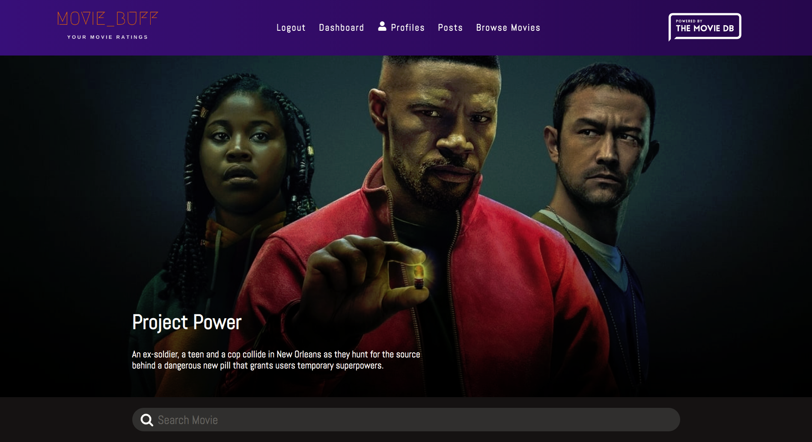

# Movie Buff

MERN application to browse your favorite Movies, TV shows, and share ratings with friends.



[Movie Buff](http://movie-buff-mern.herokuapp.com)

## Getting Started

These instructions will get you a copy of the project up and running on your local machine for development and testing purposes.

### Prerequisites

What things you need to install the software and how to install them

- npm

```
npm install npm@latest -g
```

### Installing

1. Clone the repo

```
git clone https://github.com/austinmdem/movie-buff.git
```

2. Run npm install inside project root directory

```
npm install
```

3. Get an API Key from The MovieDB

```
Replace "mongoURI" in config/default.json with new api key
```

4. Start the server

```
npm run dev (to run frontend along with nodejs backend server)
```

5. Explore

```
Enjoy! :)
```

## Built With

* [React](https://reactjs.org/) - The JavaScript framework used
* [Redux](https://redux.js.org/) - State Management
* [styled-components](https://styled-components.com/) - CSS Framework
* [The MovieDB](https://www.themoviedb.org/) - Movie Database API
* [MongoDB](https://www.mongodb.com/) - MongoDB Atlas
* [Express](https://expressjs.com/) - Expressjs Node Framework

## Contributors

* **Austin Deming** - *Initial work* - [AD Web Development](http://www.austindeming.com/)


## License

This project is licensed under the MIT License - see the [LICENSE.md](LICENSE.md) file for details

## Acknowledgments

* [VS Code](https://code.visualstudio.com/) - Text Editor
* Inspiration


Viewport
Window
×
×
×
Viewport
Window
×
×
×
